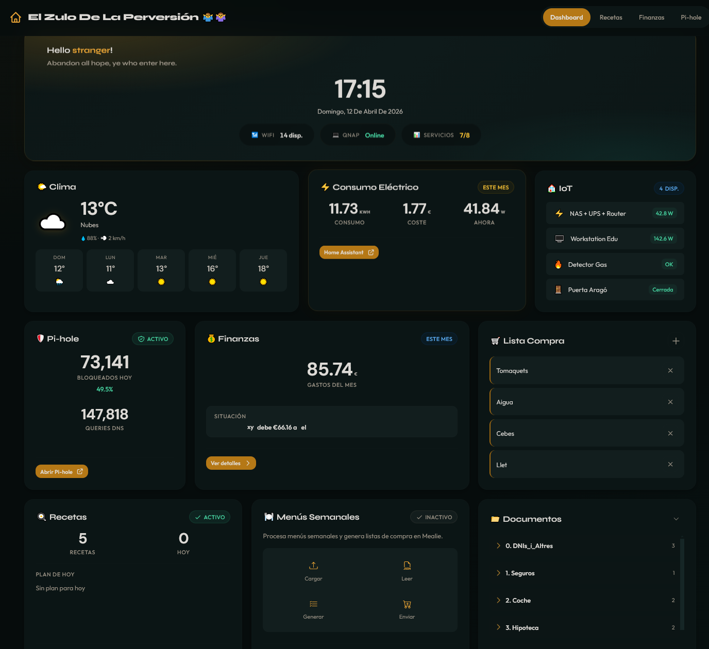
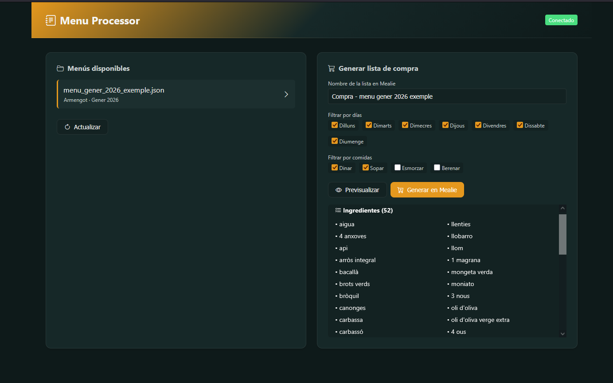

| Vista |
|------|
| **Dashboard** |
| <p align="center"></p> |
| **Menu Processor** |
| <p align="center"></p> |

# 🏠 Intranet Casa - Dashboard Familiar

Os presento mi miniproyecto personal de INTRANET DASHBOARD codificado personalmente y usando técnologia "agentic" con **MCP, reglas, flujo y memoria.** Mi intención es tener mi propio cuadro de mando para gestión del hogar con integración de servicios en contenedores docker 😀

## 🎯 Características

- ✨ Dashboard moderno con Bento Grid layout
- 🌓 Dark theme elegante y responsive
- 📱 Diseño mobile-first
- ⚡ **Consumo eléctrico en tiempo real** (Home Assistant)
- 🏠 **Dispositivos IoT** - sensores y enchufes desde Home Assistant
- 📊 **Estado de servicios** - popup con detalle de cada servicio (hover/click)
- 🛡️ **Pi-hole** con estadísticas de bloqueo
- 🍳 **Mealie** para gestión de recetas
- 🌤️ **Clima** con OpenWeatherMap
- 📝 **Lista de la compra** compartida
- 💰 **Finanzas compartidas** (Settle Up)
- 📚 **Documentos NAS** (acceso a archivos)
- 🔐 **DNSCrypt-proxy** - healthcheck de servidor DNS encriptado
- 🍽️ **Menu Processor** - procesador de menús con estado dinámico (activo/desactivado) y botón deshabilitado cuando el servicio está apagado

## 🛠️ Stack Tecnológico

- **Backend**: Flask + Gunicorn
- **Frontend**: HTML5, CSS3 (Variables CSS), JavaScript Vanilla
- **Containerización**: Docker + Docker Compose
- **Reverse Proxy**: Nginx Proxy Manager
- **NAS**: QNAP TS-264 con Container Station
- **Integraciones**: Home Assistant, Pi-hole, Mealie, OpenWeatherMap

## 🧩 Model‑Context Engineering (MCE)

Este proyecto aplica Model Context Protocol junto con una estructura de reglas, flujos y memoria persistente para mantener coherencia técnica, calidad en el código y un estilo de desarrollo reproducible.
El objetivo no es “usar IA”, sino integrarla como parte del proceso de ingeniería, de forma controlada y predecible.

### 📁 Estructura `.windsurf/`

> **Nota**: La carpeta `.windsurf.bak/` contiene un backup de las skills, workflows y rules originales de este proyecto. Estas configuraciones fueron consolidadas en el monorepo padre. Lo mantengo aquí como ejemplo de integración MCE para quienes quieran ver cómo estructuro las reglas para desarrollo asistido por IA.

```
.windsurf/
├── rules/              # Reglas de contexto por área
│   ├── backend.md      # Patrones Flask, clientes API, cache
│   ├── frontend.md     # JavaScript, CSS BEM, accesibilidad
│   ├── orchestrator.md # Flujo de trabajo general
│   └── testing.md      # Pytest, fixtures, mocks
├── skills/             # Tareas reutilizables
│   ├── añadir-servicio/    # Integrar nuevo servicio externo
│   ├── crear-cliente/      # Cliente API con requests.Session
│   ├── crear-endpoint/     # Nuevo endpoint en blueprints
│   ├── crear-widget/       # Widget frontend completo
│   └── commit/             # Conventional Commits
├── workflows/          # Automatizaciones
│   ├── validar.md      # Lint + format + tests
│   └── fix-lint.md     # Auto-fix con ruff
└── memories/           # Contexto persistente
    ├── general.md      # Stack y convenciones
    └── git.md          # Conventional Commits
```

### 🛠️ Skills Disponibles

| Skill | Descripción |
|-------|-------------|
| `@añadir-servicio` | Integrar servicio externo completo (config + cliente + endpoint + widget) |
| `@crear-cliente` | Cliente API con `requests.Session`, retry y error handling |
| `@crear-endpoint` | Endpoint Flask con cache y logging |
| `@crear-widget` | Widget frontend con fetch async y estados de carga |
| `@commit` | Mensaje siguiendo Conventional Commits |

### 📋 Workflows

| Comando | Acción |
|---------|--------|
| `/validar` | Ejecuta ruff lint + format + pytest |
| `/fix-lint` | Auto-corrige errores de lint |

### 🧠 Tecnologías AI

- **MCP (Model Context Protocol)**: Integración con herramientas externas
- **Context7**: Documentación actualizada de librerías
- **Sequential Thinking**: Resolución de problemas complejos
- **Memory System**: Persistencia de contexto entre sesiones


## 📦 Instalación

### 📋 Requisitos
- Python 3.11+ instalado
- Git

### 1. Clonar/Crear estructura

```bash
mkdir intranet && cd intranet
# Copiar todos los archivos según la estructura
```

### 2. Entorno Virtual

```bash
python -m venv venv
venv\Scripts\activate  # Windows
# o
source venv/bin/activate  # Linux/Mac
```

### 3. Dependencias

```bash
pip install -r requirements.txt
```

### 4. Configuración

Copia `.env.example` a `.env` y configura tus variables:

```bash
cp .env.example .env
# Edita .env con tus claves API y configuraciones
```

Usa **el mismo nombre de archivo (`.env`) en todos los entornos**:
- Local: `.env` con URLs de dominio interno (`ha.local`, `mealie.local`)
- NAS: `.env` con URLs service-to-service (`http://homeassistant:8123`, `http://mealie:9000`)

Variables importantes:
```bash
# Perfil de ejecución
ENV_TARGET=local          # local | nas
FLASK_ENV=development     # development | production

# API Keys
OPENWEATHER_API_KEY=tu_api_key

# URLs de servicios por entorno
MEALIE_BASE_URL_LOCAL=http://mealie.local
MEALIE_BASE_URL_NAS=http://mealie:9000
PIHOLE_URL=http://YOUR_PIHOLE_IP/admin
HOMEASSISTANT_URL_LOCAL=http://ha.local
HOMEASSISTANT_URL_NAS=http://homeassistant:8123

# Tokens
HOMEASSISTANT_TOKEN=tu_long_lived_token
SETTLEUP_API_KEY=tu_api_key
```

### 5. Ejecutar

#### Opción A: Script automático (recomendado)
```bash
# Windows
start.bat

# Linux/Mac  
./start.sh
```

#### Opción B: Manual
```bash
# Con venv activado
python app.py
```

### 🌐 Acceso
- **Dashboard**: http://localhost:5000
- **APIs**: http://localhost:5000/api/*

### 🏗️ Estructura del Proyecto
```
intranet/
├── app.py              # App Flask principal
├── config.py           # Configuración
├── blueprints/         # Rutas y APIs
│   ├── main.py         # Endpoints principales
│   └── energy_client.py # Cliente Home Assistant
├── static/            # CSS, JS, imágenes
│   ├── css/           # Estilos
│   └── js/            # JavaScript
├── templates/         # Plantillas HTML
├── requirements.txt   # Dependencias Python
├── .env              # Variables de entorno (NO subir a git)
├── .env.example      # Plantilla de variables
├── start.bat         # Script inicio Windows
├── start.sh          # Script inicio Linux/Mac
└── venv/             # Entorno virtual (NO subir a git)
```

## ⚡ Integración con Home Assistant (Consumo Eléctrico)

### 📋 Requisitos
- Home Assistant instalado y accesible
- Token de acceso largo de Home Assistant
- Sensores de energía configurados

### 🔧 Configuración

#### 1. Obtener Token de Home Assistant
1. Ve a Home Assistant → Perfil de usuario
2. Desplázate hasta "Tokens de acceso largo"
3. Crea nuevo token con nombre "Intranet Dashboard"
4. Copia el token generado

#### 2. Configurar Variables
Añade a tu archivo `.env`:
```bash
ENV_TARGET=local
HOMEASSISTANT_URL_LOCAL=http://ha.local
HOMEASSISTANT_URL_NAS=http://homeassistant:8123
HOMEASSISTANT_TOKEN=tu_long_lived_access_token
```

#### 3. Sensores Requeridos
La integración espera estos sensores en Home Assistant:

**Consumo Mensual**
- Entity ID: `sensor.endoll_ups_nas_router_energy_month`
- Tipo: Sensor numérico (kWh)

**Coste Energía**
- Entity ID: `sensor.endoll_ups_nas_router_energy_cost`
- Tipo: Sensor numérico (€/kWh o € total)

**Potencia Actual**
- Entity ID: `sensor.endoll_ups_nas_router_power`
- Tipo: Sensor numérico (W)

### 📊 Métricas Mostradas

- **Consumo del mes**: Total kWh acumulado
- **Coste del mes**: Total € calculado (automático si es €/kWh)
- **Potencia actual**: Consumo instantáneo en W

### 🎨 Formato de Visualización

- **Unidades integradas**: `5.82kWh` | `0.41€` | `41.97W`
- **Estilo consistente**: Valores grandes y en negrita
- **Iconos descriptivos**: ⚡ para energía

### ⚡ Cache y Performance

- **Cache**: 5 minutos (optimizado para producción)
- **Refresh**: Cada 10 minutos en frontend
- **Logs**: Debug detallado para troubleshooting

### 🔍 Troubleshooting

#### Datos no actualizan inmediatamente
- **Cache de 5 minutos** por defecto
- Espera 5 minutos o reduce cache para desarrollo

#### Variables .env no cargan en Windsurf
- Crea `.vscode/settings.json`:
```json
{
    "python.terminal.useEnvFile": true
}
```

#### Documentos 404 en desarrollo
- Normal: busca ruta NAS `/mnt/Documentos`
- Funcionará en producción

## 🛡️ Integración Pi-hole

### Configuración
```bash
PIHOLE_IP=YOUR_PIHOLE_IP
PIHOLE_URL=http://YOUR_PIHOLE_IP/admin
PIHOLE_PASSWORD=tu_password_hash
```

### Métricas
- **Anuncios bloqueados hoy**
- **Porcentaje de bloqueo**
- **Queries DNS totales**

## 🍳 Integración Mealie

### Configuración
```bash
MEALIE_BASE_URL_LOCAL=http://mealie.local
MEALIE_BASE_URL_NAS=http://mealie:9000
MEALIE_API_KEY=tu_api_key
```

### Funcionalidades
- **Total de recetas**
- **Comidas planificadas hoy**
- **Acceso directo a Mealie**

## 🌤️ Integración Clima

### Configuración
```bash
OPENWEATHER_API_KEY=tu_api_key
WEATHER_CITY=Barcelona
WEATHER_COUNTRY=ES
```

### Datos mostrados
- **Temperatura actual**
- **Descripción del clima**
- **Pronóstico 5 días**

## 🏠 Dispositivos IoT (Home Assistant)

### Descripción
Widget que muestra el estado de dispositivos IoT conectados a Home Assistant:
- **Sensores de potencia**: consumo en W, kWh
- **Sensores binarios**: puertas, detectores de gas, movimiento
- **Enchufes inteligentes**: estado on/off con consumo

### Configuración
Los dispositivos se configuran en `config.py` → `HA_DEVICES`:

```python
HA_DEVICES = {
    "power": [
        {
            "entity_id": "sensor.enchufe_power",
            "name": "NAS + Router",
            "icon": "⚡",
            "unit": "W",
        },
    ],
    "sensors": [
        {
            "entity_id": "binary_sensor.detector_gas",
            "name": "Detector Gas",
            "icon": "🔥",
            "type": "binary",
            "state_on": "¡Detectado!",
            "state_off": "OK",
        },
    ],
}
```

### Añadir nuevo dispositivo
1. Buscar `entity_id` en HA → Configuración → Entidades
2. Añadir a la categoría correspondiente en `config.py`
3. Reiniciar la aplicación

### Endpoint
- **URL**: `/api/devices`
- **Cache**: 1 minuto
- **Respuesta**: Lista de dispositivos con estado actual

## 💰 Integración Finanzas (Settle Up)

### Configuración
```bash
SETTLEUP_EMAIL=tu_email@gmail.com
SETTLEUP_PASSWORD=tu_password
SETTLEUP_GROUP_ID=tu_group_id
SETTLEUP_API_KEY=tu_api_key
```

### Métricas
- **Estado del grupo**
- **Gastos del mes**

## 🐳 Docker (Producción)

### Optimizado para QNAP TS-264 (8GB RAM)

```yaml
services:
  intranet:
    build: .
    command: gunicorn --bind 0.0.0.0:5000 --workers 1 --threads 4 --worker-class gthread --timeout 45 app:app
    environment:
      - ENV_TARGET=nas
      - FLASK_ENV=production
    volumes:
      - ./cache:/app/cache  # Cache persistente
    deploy:
      resources:
        limits:
          cpus: '0.5'
          memory: 384M
        reservations:
          cpus: '0.25'
          memory: 192M
```

### Ejecutar
```bash
cd /share/Container/intranet
mkdir -p cache
docker compose up -d --build intranet
```

## 🔧 Configuración Avanzada

### Cache
- **Tiempo**: 5 minutos por defecto
- **Propósito**: Reducir load en servicios externos
- **Ajuste**: Modificar `@cache.cached(timeout=300)`

### Logs
- **Nivel**: INFO por defecto, DEBUG para desarrollo
- **Ubicación**: Consola y logs de Flask
- **Especial**: Home Assistant muestra DEBUG detallados

### Seguridad
- **Tokens**: Almacenados en variables de entorno
- **Permisos**: Solo lectura de sensores
- **Comunicación**: HTTPS cuando está disponible

## 🚀 Despliegue

### Desarrollo Local
```bash
python app.py
```

### Producción (NAS) - Flujo rsync + Docker

#### Requisitos previos (solo una vez)
1. **Configurar SSH keys** para acceso sin password al NAS
2. **Crear alias SSH** en `~/.ssh/config`:
```
Host nas
    HostName 192.168.1.X
    User admin
```
3. **Crear carpeta en NAS**:
```bash
ssh nas "mkdir -p /share/Container/intranet"
```

#### Despliegue (cada vez que hagas cambios)

**Desde WSL (recomendado):**
```bash
# Sincronizar archivos al NAS
./deploy.sh intranet

# Reconstruir contenedor en NAS
ssh nas "cd /share/Container/intranet && docker compose up -d --build"
```

El script `deploy.sh` usa rsync con exclusiones (venv, cache, .git, etc.) para sincronización incremental rápida.

### Reverse Proxy (Nginx Proxy Manager)
```nginx
location / {
    proxy_pass http://intranet:5000;
    proxy_set_header Host $host;
    proxy_set_header X-Real-IP $remote_addr;
    proxy_set_header X-Forwarded-For $proxy_add_x_forwarded_for;
}
```

## 📈 Monitorización y Debug

### Endpoints API disponibles

Todos los endpoints devuelven JSON y se pueden probar directamente en el navegador o con `curl`:

| Endpoint | Servicio | Cache | Descripción |
|----------|----------|-------|-------------|
| `/api/energy` | Home Assistant | 5 min | Consumo eléctrico (kWh, €, W) |
| `/api/pihole` | Pi-hole | 5 min | Estadísticas DNS (ads bloqueados) |
| `/api/mealie` | Mealie | 5 min | Recetas y menú semanal |
| `/api/shopping` | Mealie | 3 min | Lista de compra activa |
| `/api/weather` | OpenWeather | 15 min | Clima actual y pronóstico |
| `/api/settleup` | Settle Up | 5 min | Balance de gastos compartidos |
| `/api/devices` | Home Assistant | 1 min | Estado de dispositivos IoT |
| `/api/menu-processor` | Menu Processor | 5 s | Healthcheck rápido del servicio (`up/down`) |
| `/api/dnscrypt` | DNSCrypt | 1 min | Healthcheck via DNS query |

**Ejemplo de uso:**
```bash
# Desde terminal
curl http://localhost:5000/api/energy

# O directamente en navegador
http://localhost:5000/api/pihole
```

Si algo falla, el endpoint devuelve `{"error": "mensaje"}` con código HTTP 500/503.

### 🍽️ Estado manual de Menu Processor

El contenedor `menu-processor` se puede encender/apagar manualmente desde Container Station/Qmanager y el dashboard adapta la UX automáticamente:

- Si `/api/menu-processor` responde `status=up`: badge `Activo` y botón habilitado.
- Si `/api/menu-processor` responde `status=down` o error: badge `Desactivado` y botón en gris, no clicable.

Esta lógica está preparada en frontend para extenderse fácilmente a otras cards de servicios.

### Logs

Los logs van a la consola de Flask/Gunicorn. En Docker:
```bash
docker logs intranet
docker logs -f intranet  # seguir en tiempo real
```

## 🐛 Troubleshooting Común

### Problemas frecuentes
1. **Variables .env no cargan**: Configura Windsurf o reinicia
2. **Cache con errores viejos**: Espera 5 minutos o limpia cache
3. **Documentos 404**: Normal en desarrollo, funcionará en NAS
4. **Tokens expirados**: Genera nuevo token en Home Assistant

### Debug mode
```bash
FLASK_DEBUG=1 python app.py
```

## 🤝 Contribuciones

1. Fork del proyecto
2. Feature branch
3. Pull request

## 📄 Licencia

MIT License - libre uso personal y comercial

---

## 🎯 Roadmap

### ✅ Completado
- [x] **Dispositivos IoT** - sensores y enchufes desde Home Assistant
- [x] **Popup estado servicios** - detalle de cada servicio con hover/click
- [x] **Optimización Docker** - Alpine, 1 worker, cache persistente
- [x] **DNSCrypt-proxy** - healthcheck de servidor DNS encriptado
- [x] **Menu Processor** - integración con procesador de menús semanales

### 🔜 Pendiente
- [ ] **Monitorización del NAS** (espacio, temperatura)
- [ ] **Alertas personalizadas** (umbral de consumo)
- [ ] **Gráficos históricos** (consumo energético)
